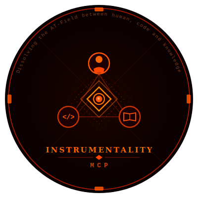

<div align="center">
  
</div>

# Instrumentality-MCP

A structured knowledge base for monorepos, managed through MCP tools. Works with Claude Code, Cursor, and any MCP-compatible agent.

> **No API keys required.** The MCP server returns prompts and context. Your agent does the reasoning.

---

## What it does

Instrumentality-MCP creates a `knowledge/` folder in your project and keeps it synchronized with your codebase — in both directions. Code changes are detected and surfaced for KB review (code→KB); KB spec changes are flagged for developers to verify the implementation still matches (KB→code). Instead of scattering product context across Notion, Confluence, and README files, everything lives as structured Markdown beside your code — versioned in git, loaded automatically into your agent's context when relevant.

```
your-project/
  src/                   ← your code
  knowledge/
    features/            ← product features
    flows/               ← user flows and sequences
    data/schema/         ← data models (DBML format, one file per database)
    ui/                  ← component specs and copy
    validation/          ← validation rules
    integrations/        ← third-party integrations
    decisions/           ← architectural decisions
    assets/
      design/            ← design files and diagrams
      screenshots/       ← UI screenshots referenced in KB docs
    standards/           ← how to work on this project (contextually loaded)
      code/              ← loaded when writing/reviewing code
      knowledge/         ← loaded when writing/reviewing KB files
      process/           ← task workflows and checklists
    sync/
      code-drift.md      ← code changed, KB may be stale (PM reviews)
      kb-drift.md        ← KB changed, code may be stale (dev reviews)
      review-queue.md    ← git merge conflicts on KB files
      import-review.md   ← unclassified import chunks
      drift-log/         ← resolved drift audit trail (one file per month)
      inbound/           ← issue triage reports (written by kb_issue_triage)
      outbound/          ← task breakdowns for PM tools (written by kb_issue_plan)
    _index.yaml          ← auto-generated dependency graph
    _rules.md            ← KB configuration (depth policy, token_budget, code path patterns, secrets)
    exports/             ← kb_export output files
    _prompt-overrides/   ← project-specific prompt overrides (takes priority over _templates/prompts/)
    _mcp/                ← MCP server (do not edit)
    _templates/          ← KB and prompt templates (customizable)
      data/              ← schema and enum templates
      ui/                ← UI component templates
      standards/         ← standards templates
      prompts/           ← prompt templates (overridable via _prompt-overrides/)
```

---

## Installation

**1. Install dependencies**

Clone this repo and install:

```bash
git clone <this-repo> kb-mcp
cd kb-mcp/knowledge/_mcp && npm install
```

**2. Configure your agent**

Point your agent's MCP config to the server using its absolute path on disk.

For Cursor, add to `.cursor/mcp.json` (or run `kb_init` — it writes this automatically):

```json
{
  "mcpServers": {
    "kb": {
      "command": "node",
      "args": ["/absolute/path/to/kb-mcp/knowledge/_mcp/server.js"]
    }
  }
}
```

For Claude Code, add to `.claude/mcp.json`:

```json
{
  "mcpServers": {
    "kb": {
      "command": "node",
      "args": ["/absolute/path/to/kb-mcp/knowledge/_mcp/server.js"]
    }
  }
}
```

**3. Bootstrap**

Ask your agent: `"Initialize the knowledge base for this project"` — it will call `kb_init`.

Or call it directly:

```js
// non-interactive
kb_init({ interactive: false, config: { projectName: "MyApp", appNames: ["web", "api"] } })
```

---

## Tools

| Tool | What it does |
|------|-------------|
| `kb_init` | Bootstrap `knowledge/` folder, git hooks, merge drivers, MCP config, and agent rule files (`CLAUDE.md`, `.cursorrules`, `.windsurfrules`). Re-run to update `code_path_patterns` when stack changes |
| `kb_get` | Load relevant KB files into agent context (keyword + scope filtering, token budget aware). `max_tokens` overrides the budget; default reads `token_budget` from `_rules.md`. Optional `task_context` (`creating`, `fixing`, `reviewing`) adjusts relevance scoring — `creating` boosts same-type files, `fixing` boosts code standards, `reviewing` includes drift targets |
| `kb_write` | Write a KB file and auto-reindex. Rejects paths outside `knowledge/` |
| `kb_reindex` | Rebuild `_index.yaml` from all KB files, run lint. Returns up to 20 lint violations in the result |
| `kb_lint` | Lint KB files for front-matter correctness and secret patterns |
| `kb_scaffold` | Create a new KB file from template (types: `feature`, `flow`, `schema`, `validation`, `integration`, `decision`, `standard`, `group`, `enums`, `relations`, `components`, `permissions`, `copy`, `tech-stack`, `conventions`, `agent-rules`). Two-phase when `description` is given: loads related KB context, checks for overlapping entries, returns a fill prompt → agent fills → writes. `agent-rules` is special: writes `CLAUDE.md`, `.cursorrules`, and `.windsurfrules` to the project root. Use `force: true` to regenerate existing files |
| `kb_ask` | Ask a question about the KB. Classifies intent (query / sync / brainstorm / challenge / onboard / generate) and returns relevant context. Short tech terms (api, jwt, sql, etc.) are preserved in keyword extraction |
| `kb_drift` | Bidirectional drift detection. Phase 1: code→kb (code changed, KB stale) and kb→code (KB changed, code may be stale). Writes to queue files in `sync/`. Handles file/folder renames as single linked operations — code renames annotate the entry with `← renamed from`, KB renames surface broken `[[wikilink]]` references with a count and file list. Stale `_rules.md` patterns (old path matched, new path doesn't) are returned as `stale_patterns[]` warnings. Phase 2: three resolution types — `summaries` (KB updated), `reverted` (code was wrong), `kb_confirmed` (kb→code reviewed). The pre-push hook passes the remote name automatically; sync baseline is resolved via graduated fallback: upstream tracking ref → `<remote>/<branch>` → closest parent branch (merge-base across all remote branches, so `main→dev→feature` correctly finds `dev`) → skip with warning. Submodules with a different remote name than the parent are detected and warned about explicitly (with a fix command), not silently skipped or compared against the wrong remote |
| `kb_impact` | Analyze what KB files are affected by a proposed change, using the dependency graph |
| `kb_import` | Import documents (PDF, DOCX, MD, TXT, HTML) into KB files. **Auto-classify mode** (recommended): paginated batches with multi-label classification, cross-reference generation, and an import plan for review before writing. **Classic mode**: Phase 1 returns chunks, Phase 2 writes agent-generated files. Supports DOCX images. Rejects paths outside `knowledge/` |
| `kb_export` | Export KB in multiple formats. `json` writes directly (no agent needed). `markdown`, `html`, `confluence`, `notion`, `docx`, `pdf` are two-phase via agent. Supports `purpose` to guide tone/structure, `type` filter (e.g. all flows), multi-scope (array of ids/domains), and automatic pagination for large KBs. PDF and DOCX output includes proper headings, lists, and inline formatting |
| `kb_migrate` | Migrate KB files after `_rules.md` structure changes. `since` sets the comparison ref (auto-detected if omitted); `dry_run` previews prompts without writing |
| `kb_analyze` | Scan project source files and generate a KB coverage inventory. Groups files by their KB target using `code_path_patterns` from `_rules.md`. Optional `write_drafts` creates draft KB files (`confidence: draft`) for uncovered groups. Useful for bootstrapping KB on legacy projects |
| `kb_extract` | Derive a standards document from existing code or KB files. Phase 1: samples representative files and returns a prompt for the agent to observe patterns and fill the template. Phase 2: writes the filled standard. Supports `paths` to narrow sampling (glob patterns for code, subfolder name for KB), and `app_scope` for multi-stack projects |
| `kb_issue_triage` | Triage an issue against the KB. Phase 1: searches KB for related docs, returns a prompt to draft a triage report with root-cause hypothesis and suggested KB updates. Phase 2: writes the report to `sync/inbound/`. Supports `issue_id`, `source` (jira/github/linear), `labels`, `priority`, and `app_scope` |
| `kb_issue_plan` | Generate work items from KB docs for a PM tool. Phase 1: gathers source docs by `scope`/`type`/`keywords`, returns a prompt to break them into stories/tasks with acceptance criteria. Phase 2: writes task breakdown YAML to `sync/outbound/`. Supports `target` (jira/github/linear) and `project_key` |
| `kb_issue_consult` | Consult the KB before filing an issue. Searches for related docs and returns a prompt for the agent to advise the reporter with enriched context, suggested labels, and relevant standards. Single-phase — no write step |
| `kb_sub` | Submodule coordination. `status`: shows parent + submodule branches, pointer changes, owned/shared types. `push`: pushes submodules first (correct order), then parent — supports `dry_run` to preview the plan. `merge_plan`: returns correct merge sequence for feature-to-main |
| `kb_autotag` | Auto-extract tags from KB file content and write them to frontmatter. Improves `kb_ask` search accuracy when files have empty `tags: []`. Extracts from headings (3×), bold text, inline code, file path, and body word frequency. Merges with existing tags — never removes manual ones. Run `file_path: "all"` (default) or target a single file |
| `kb_autorelate` | Discover semantic relations between KB files using keyword overlap (Overlap Coefficient). Proposes `depends_on` links. Use `dry_run: true` to preview before writing. `threshold` (default `0.25`) controls sensitivity. Direction is inferred from type priority: schemas and validation are upstream, flows and decisions are downstream |
| `kb_schema` | Query database schema files (DBML format) with table-level extraction. `list`: returns all table/enum names in a schema file. `query`: extracts specific tables by name (`entities`) or keyword relevance (`keywords`). Schema files use one-file-per-database layout with dbdiagram.io DBML syntax in the markdown body. `kb_get` automatically filters schema files to relevant tables when loading context |

### `_rules.md` configuration reference

Key fields you can set in the YAML front-matter of `knowledge/_rules.md`:

| Field | Default | Purpose |
|-------|---------|---------|
| `token_budget` | `8000` | Max tokens `kb_get` loads per call. Override per-call with `max_tokens` |
| `depth_policy` | see template | Max folder nesting per domain before files are grouped |
| `secret_patterns` | see template | Patterns that block KB file writes if found in content |
| `code_path_patterns` | stack preset | Maps source file globs to KB targets for drift detection |

### Two-phase tools

Several tools use a two-phase pattern — the server gathers context and returns a prompt, your agent processes it, then the server writes the result:

```
Agent calls kb_scaffold({ type: "feature", id: "checkout", description: "..." })
  → Server returns { prompt, file_path, template }

Agent reads the prompt, fills in the template content

Agent calls kb_scaffold({ type: "feature", id: "checkout", content: "<filled content>" })
  → Server writes the file
```

Same pattern applies to `kb_export`, `kb_extract`, `kb_issue_triage`, and `kb_issue_plan`. `kb_scaffold` also loads related KB files before returning the fill prompt, so the agent can check for overlapping entries and align new content with existing docs. The fill prompt includes an **overlap detection** step — if an existing KB file already covers the same topic, the agent warns before creating a duplicate. `kb_import` supports a **3-phase auto-classify mode**: (1) extract and return chunks in paginated batches for agent classification, (2) return an import plan with proposed files and cross-references, (3) write files on approval. `kb_drift` works differently — Phase 1 writes entries to queue files (no prompts returned). Review happens when PM or developer asks Claude to read the queue files; Claude fetches the git diff live and explains in plain English.

---

## Usage scenarios

### 1. Starting a new feature

You're about to build a payment flow. Load relevant context first, then scaffold the feature doc.

```
"Load KB context for the checkout and payment features"
→ kb_get({ keywords: ["checkout", "payment"], task_context: "creating" })

"Scaffold a new feature doc for Stripe payment processing"
→ kb_scaffold({ type: "feature", id: "stripe-payments", description: "Stripe integration: charge cards at checkout, handle webhooks for refunds and disputes, store payment method tokens per user." })
→ Agent fills the template using the returned prompt
→ kb_scaffold({ type: "feature", id: "stripe-payments", content: "<filled>" })
```

---

### 2. Keeping KB in sync after code changes

Drift detection is bidirectional and PM-gated. Code changes don't update the KB automatically — a PM or tech lead reviews the queue first.

Drift entries are written automatically by two hooks:
- **pre-push** — when you push your branch
- **post-merge** — when branches are merged (catches cross-branch semantic conflicts)

**code→kb** (code changed, KB may be stale):

```
git push
→ pre-push hook writes entry to knowledge/sync/code-drift.md:

  ## features/user-auth.md
  - KB target: features/user-auth.md
  - Code files:
    - src/auth/tokenService.ts — since a1b2c3d (2026-03-20)
  - Status: pending-review

PM opens Claude: "review code-drift.md"
→ Claude fetches: git diff a1b2c3d..HEAD -- src/auth/tokenService.ts
→ Explains in plain English: "token expiry changed from 7d to 24h, refresh tokens now rotate"
→ PM decides

"The change is correct, update the KB"
→ kb_drift({ summaries: [{ kb_target: "features/user-auth.md", summary: "Token expiry reduced to 24h, refresh tokens now rotate" }] })
→ Entry removed from code-drift.md, KB note written, resolution logged to sync/drift-log/
```

Multiple commits to the same file before PM reviews — no duplicate entries. Claude always fetches `git diff since..HEAD` so it sees all accumulated changes.

If the code was wrong instead:
```
PM: "That change was a mistake, it will be reverted"
→ kb_drift({ reverted: [{ code_file: "src/auth/tokenService.ts" }] })
→ Code file removed from entry, no KB update written
```

**kb→code** (KB spec changed, code may be stale):

```
PM updates knowledge/features/checkout.md and pushes
→ pre-push hook writes entry to knowledge/sync/kb-drift.md:

  ## features/checkout.md
  - KB file: features/checkout.md
  - Code areas to review:
    - src/app/api/checkout/**
    - src/components/**Form*
  - Since: c3d4e5f (2026-03-20)
  - Status: pending-review

Developer opens Claude: "review kb-drift.md"
→ Claude fetches: git diff c3d4e5f..HEAD -- knowledge/features/checkout.md
→ Explains what spec changed in plain English
→ Developer checks the listed code areas

"Code already matches the updated spec"
→ kb_drift({ kb_confirmed: [{ kb_file: "features/checkout.md" }] })
→ Entry closed, resolution logged to sync/drift-log/
```

**Merge-conflict protocol for drift queues.** The queue files (`sync/code-drift.md`, `sync/kb-drift.md`) and the drift log are committed with `merge=union` in `.gitattributes`, so branches rarely conflict:

- **Different entries on each branch** — union concatenates cleanly, no action needed.
- **Same entry on both branches** — real semantic conflict. Resolve by hand: dedupe the duplicate heading and keep the entry whose `since` commit is later.
- **Baseline line (`<!-- baseline: <sha> -->`)** — the post-merge hook runs `kb_drift({ dedup_baselines: true })` automatically, which collapses duplicates to whichever SHA is the descendant of the other. If the hook didn't run (shallow clone, detached-HEAD merge), remove the ancestor line manually.

---

### 3. Impact analysis before a breaking change

You want to remove the legacy `v1/` API. Find out what breaks.

```
"What KB docs are affected if we remove the v1 REST API?"
→ kb_impact({ change_description: "Remove v1 REST API endpoints. All clients must migrate to v2." })
→ Returns affected files (features, flows, integrations) with per-file proposals

Agent reviews proposals, updates affected KB files with kb_write
```

---

### 4. Onboarding a new developer

New backend engineer joining. Give them a structured onboarding prompt from the KB.

```
"Give me an onboarding brief for the backend scope"
→ kb_ask({ question: "onboard me on the backend — data models, auth, and key flows" })
→ Returns a structured onboarding prompt with all relevant context embedded
```

---

### 5. Importing a spec document

Product handed you a 115-page specification as a DOCX. Convert it into KB files with auto-classify mode.

```
"Import the spec using auto-classify"
→ kb_import({ source: "docs/spec.docx", auto_classify: true })
→ Server extracts text (preserving headings and images from DOCX),
  chunks by heading hierarchy, returns first batch of 5 chunks
  with a classify prompt

Agent classifies each batch (multi-label: one chunk can be a feature + flow + validation)

→ kb_import({ source: "docs/spec.docx", auto_classify: true,
    classifications: [
      { chunk_id: "chunk-1", types: [
        { type: "feature", confidence: 0.9, suggested_id: "invoice-create", reason: "..." },
        { type: "validation", confidence: 0.75, suggested_id: "invoice-create-rules", reason: "..." }
      ], suggested_group: "billing" }
    ], cursor: 5 })
→ Returns next batch (or import plan when all batches classified)

Import plan includes proposed files, cross-references ([[wikilinks]] and depends_on),
and items needing review (low confidence)

"Looks good, write it"
→ kb_import({ source: "docs/spec.docx", auto_classify: true, approve: true })
→ Server writes all files with cross-references as [[wikilinks]] in content and reindexes
```

**Classic mode** (without `auto_classify`) still works as before — Phase 1 returns all chunks with classify prompts, Phase 2 writes agent-generated files via `files_to_write`.

**DOCX image support**: Embedded images are extracted to `knowledge/assets/imports/` and referenced as markdown image links in the chunked text.

---

### 6. Exporting for stakeholders

Export the KB with an optional `purpose` to guide tone, depth, and structure. Filter by `type` (all flows, all integrations) or pass multiple scopes.

```
# Full KB as markdown for a client demo
"Export the KB as a client-facing overview"
→ kb_export({ scope: "all", format: "markdown",
    purpose: "Client demo — emphasize capabilities, hide implementation details" })
→ Returns { prompt, output_path } — agent renders content tailored to the purpose

→ kb_export({ scope: "all", format: "markdown", rendered_content: "<rendered>" })
→ Writes to knowledge/exports/all-2026-03-22.md

# All flows as PDF
"Export all user flows as a PDF"
→ kb_export({ type: "flow", format: "pdf",
    purpose: "QA team reference for all user workflows" })
→ Agent renders → PDF with proper headings, bullet lists, page breaks per section

# Specific features as DOCX for CFO review
"Export billing features for the CFO"
→ kb_export({ scope: ["invoice-create", "payment-process", "refund-flow"],
    format: "docx", purpose: "CFO review of billing features — business value focus" })
→ DOCX with Heading 1/2/3 styles, numbered lists, bold/italic formatting

# Combine type + scope: all validations in a domain
→ kb_export({ scope: "billing", type: "validation", format: "markdown",
    purpose: "QA team needs all billing validation rules" })
```

Large KBs are paginated automatically — the agent renders each page and combines them before writing.

---

### 7. Bootstrapping KB on a legacy codebase

You have an existing project with 200+ source files and no KB. Use `kb_analyze` to scan the codebase and generate a coverage inventory.

```
"Analyze the codebase and show me what KB files we need"
→ kb_analyze({ depth: 4 })
→ Returns inventory: groups of source files mapped to KB targets,
  which ones already have KB files, and suggested actions (create/review/skip)

Review the inventory, then create drafts:

"Create draft KB files for uncovered groups"
→ kb_analyze({ write_drafts: true })
→ Creates draft KB files with confidence: draft, listing source files
  and open questions for the agent or developer to fill in
```

Each draft includes a file list, summary placeholder, and open questions. Review and flesh out each one — drafts are a starting point, not a finished product.

---

### 8. Creating standards for code and knowledge

Standards govern *how to work on this project* — for both code files and KB files. They live in `knowledge/standards/` and are loaded contextually when relevant.

**Auto-scaffold on init**: when `kb_init` detects a stack (React, Go, etc.), it creates `standards/code/tech-stack.md` and `standards/code/conventions.md` as template stubs for you to fill.

**Scaffold manually:**
```
"Create a component standard"
→ kb_scaffold({ type: "standard", id: "components", group: "code",
    description: "Components must be under 200 lines, have a story, and reuse the design system" })
→ Agent fills the template: purpose, rules, why, examples, exceptions
→ kb_scaffold({ type: "standard", id: "components", group: "code", content: "<filled>" })
```

**Derive from existing code** (best for existing projects):
```
"Derive a components standard from our source code"
→ kb_extract({ source: "code", target_id: "components", target_group: "code" })
→ Returns prompt with sampled code files — agent observes actual patterns and fills the template
→ kb_extract({ source: "code", target_id: "components", target_group: "code", content: "<filled>" })
```

**Derive from existing KB files:**
```
"Derive a feature-writing standard from our existing feature docs"
→ kb_extract({ source: "knowledge", target_id: "feature-writing",
    target_group: "knowledge", paths: "features" })
```

**Multi-stack** (monorepos with different backend/frontend stacks):
```
kb_scaffold({ type: "standard", id: "go-conventions", group: "code", app_scope: "backend" })
kb_scaffold({ type: "standard", id: "ts-conventions", group: "code", app_scope: "frontend" })
```
`kb_get({ app_scope: "frontend" })` loads only the frontend standard; `app_scope: "backend"` loads only the Go one.

Standards are loaded via `kb_get` based on context — `task_context: "creating"` boosts `standards/knowledge/` files, `task_context: "fixing"` boosts `standards/code/` files. Any file can opt into unconditional loading by setting `always_load: true` in its frontmatter.

---

### 9. Improving KB search quality after import

After importing documents or creating KB files in bulk, tags are often empty — `kb_ask` falls back to weak path-matching. Run the two enrichment tools to fix this.

```
"Tag all KB files automatically"
→ kb_autotag()
→ Returns: { tagged: 40, tags_added: 333, sample: { "features/auth.md": ["auth", "jwt", ...] } }

"Discover missing depends_on relations"
→ kb_autorelate({ dry_run: true })
→ Returns proposals: [{ source: "features/checkout.md", target: "features/auth.md", score: 0.64, shared_terms: [...] }]

"Looks good, apply them"
→ kb_autorelate()
→ Writes depends_on links to frontmatter, reindexes

Now kb_ask finds files reliably:
→ kb_ask({ question: "how does authentication work?" })
→ context_files: ["features/auth.md", "flows/auth-flow.md", "validation/auth-rules.md"]
```

Both tools are safe to re-run — `kb_autotag` merges with existing tags, `kb_autorelate` skips already-present relations and prevents cycles.

> **Future improvement — content_keywords in index (Level 2)**
>
> Currently the `kb_get` scorer matches keywords against metadata only (path, id, type, tags, depends_on) — not file body content. Tags bridge this gap, but if files lack tags they become invisible to keyword search. A future enhancement could extract content keywords during `kb_reindex` and store them as a `content_keywords` field in `_index.yaml` (not in the source file). The scorer would then search both `tags` and `content_keywords`, making files discoverable even with empty tags. This is pure Node.js (no LLM cost), adds ~1ms per file to reindex, and requires no source file writes. See `lib/tag-extract.js` for the extraction logic that could be reused.

---

### 10. Working with database schemas (DBML)

Schema files use dbdiagram.io DBML syntax — one file per database, multiple tables per file. `kb_schema` extracts individual tables so the agent only loads what's relevant.

```
# List all tables in the postgres schema
→ kb_schema({ command: "list", file: "postgres" })
→ { tables: ["users", "orders", "products", "payments"], enums: ["order_status"], refs_count: 4 }

# Extract specific tables
→ kb_schema({ command: "query", file: "postgres", entities: ["users", "orders"] })
→ Returns only users and orders Table blocks + related Ref: lines

# Keyword-based extraction
→ kb_schema({ command: "query", file: "postgres", keywords: ["payment", "billing"] })
→ Returns tables mentioning payment/billing, scored by relevance
```

When `kb_get` loads a schema file during keyword search, it automatically filters to relevant tables — the full file is never sent to the agent unless all tables match.

---

### 11. Setting up agent instructions

`kb_init` generates `CLAUDE.md`, `.cursorrules`, and `.windsurfrules` automatically. To regenerate them (e.g. after updating the template), use `kb_scaffold`:

```
"Regenerate agent rule files"
→ kb_scaffold({ type: "agent-rules", force: true })
→ Returns: { files_written: ["CLAUDE.md", ".cursorrules", ".windsurfrules"] }
```

Without `force: true`, existing files with content are not overwritten — your customizations are preserved.

---

### 12. Catching cross-branch semantic conflicts after a merge

Two developers work in parallel. Neither causes a git conflict, but together they create an inconsistency.

```
Dev A (branch: feature/new-auth):
→ Updates knowledge/features/user-auth.md
  "Session tokens now expire after 24h, refresh tokens rotate on every use"

Dev B (branch: fix/auth-service):
→ Updates src/auth/tokenService.ts
  (still implements 7-day expiry, rotation disabled)

Both branches merge to main — git has no conflict (different files)

→ post-merge hook runs drift from ORIG_HEAD:
  - sees user-auth.md changed on one branch → writes entry to kb-drift.md
  - sees tokenService.ts changed on other branch → writes entry to code-drift.md

Developer opens Claude: "review kb-drift.md"
→ Claude fetches git diff, explains: "KB now requires 24h expiry and rotating refresh tokens"
→ Developer updates tokenService.ts to match

PM opens Claude: "review code-drift.md"
→ Claude fetches git diff, explains what changed in tokenService.ts
→ PM approves: kb_drift({ summaries: [{ kb_target: "features/user-auth.md", summary: "..." }] })
```

---

### 13. PM tool integration (Jira, GitHub Issues, Linear)

The KB bridges the gap between knowledge and project management tools through a middleware layer. No direct PM tool API calls — staging files in `sync/inbound/` and `sync/outbound/` act as the interface. External adapter scripts handle actual API sync.

**Consult KB before filing an issue:**
```
PM: "I want to file a bug about login failing with expired tokens"

→ kb_issue_consult({ title: "Login fails with expired token",
                     body: "Users get 500 error instead of redirect..." })
  → Returns related KB docs (features/auth.md, flows/login.md)
  → Agent advises: "This relates to the session handling flow, step 4.
     The KB notes 24h token expiry. Suggest labels: auth, session.
     Priority: high (affects all users with expired tokens)."
```

**Triage an existing Jira bug:**
```
→ kb_issue_triage({ title: "Cart total wrong", body: "...",
                    issue_id: "PROJ-123", source: "jira",
                    labels: ["bug", "cart"], priority: "high" })
  → Phase 1: returns related KB docs + triage prompt
  → Agent fills triage report (summary, root cause hypothesis, suggested KB updates)

→ kb_issue_triage({ ..., content: "<filled triage report>" })
  → Writes to knowledge/sync/inbound/PROJ-123.md
  → Agent can then apply suggested updates to feature/flow docs via kb_write
```

**Generate work items from KB features:**
```
→ kb_issue_plan({ type: "feature", keywords: ["cart"],
                  target: "jira", project_key: "CART" })
  → Phase 1: gathers cart-related KB docs, returns planning prompt
  → Agent breaks features into stories with acceptance criteria

→ kb_issue_plan({ ..., content: "<YAML task breakdown>" })
  → Writes to knowledge/sync/outbound/2026-03-28-feature.yaml
  → Adapter script picks up YAML and creates Jira tickets
```

**Staging file flow:**
```
PM Tool (Jira, Linear, GitHub Issues)
    ↕  adapter scripts (outside MCP)
Staging files (knowledge/sync/inbound/, sync/outbound/)
    ↕  kb_issue_triage, kb_issue_plan
KB documents (knowledge/features/, flows/, standards/)
```

---

## Presets

`_rules.md` controls how drift detection maps your codebase to KB files. Presets for common stacks are in `knowledge/_mcp/presets/`:

- `nextjs.yaml`
- `react-vite.yaml`
- `react-native.yaml`
- `vue.yaml`
- `django.yaml`
- `rails.yaml`
- `nestjs.yaml`
- `spring-boot.yaml`
- `go.yaml`
- `monorepo.yaml`
- `custom.yaml`

Copy the relevant `code_path_patterns` block into your `knowledge/_rules.md`.

---

## Customizing prompts

All prompts used by the tools are in `knowledge/_templates/prompts/`. To override a prompt for your project without editing the bundled templates, create a file at `knowledge/_prompt-overrides/<prompt-name>.md`. The override directory takes priority.

---

## Git integration

`kb_init` installs:

- **Pre-commit hook** — lints KB files (warns, never blocks); warns if Tier 1 auto-generated files are staged
- **Pre-push hook** — submodule branch guard (blocks push if owned submodule is on wrong branch); runs bidirectional drift detection; appends entries to `sync/code-drift.md` (code changed) and `sync/kb-drift.md` (KB changed). Compares against the remote tracking branch tip (covers all unpushed commits, not just the last one). Re-entry guard prevents double-commits when the hook auto-commits drift files
- **Post-merge hook** — rebuilds `_index.yaml`; then runs drift detection from `ORIG_HEAD` to catch semantic conflicts between branches (KB changed on one branch, related code changed on another)
- **Merge drivers** — `kb-reindex` for `_index.yaml`, `kb-conflict` for feature/flow files, `union` for sync logs

---

## File ownership

Files in `knowledge/` have three ownership tiers. Violating them causes silent data loss — the server overwrites manual edits on the next tool run.

### Tier 1 — Agent only, never edit manually

| File | Managed by |
|------|-----------|
| `_index.yaml` | `kb_reindex` (runs after every `kb_write`) |
| `sync/drift-log/YYYY-MM.md` | `kb_drift` Phase 2 — append-only audit trail, split by month |

The pre-commit hook warns if any of these are staged. `_index.yaml` has a `# AUTO-GENERATED` header that `kb_lint` checks for.

### Tier 2 — Humans directly, no agent needed

| File | Purpose |
|------|---------|
| `_rules.md` | Project config — depth policy, code path patterns, secrets, `token_budget` |
| `_templates/` | Customize KB file templates |
| `_prompt-overrides/` | Override bundled prompts for your project |
| `features/*.md`, `flows/*.md`, etc. | KB content — developers and PMs edit directly; agent can too |

### Tier 3 — Shared / hybrid

Written by the server automatically, reviewed and resolved by humans via Claude.

| File | Written by | Human role |
|------|-----------|------------|
| `sync/code-drift.md` | pre-push + post-merge hooks (code changed, KB may be stale) | PM decides: update KB or revert code |
| `sync/kb-drift.md` | pre-push + post-merge hooks (KB changed, code may be stale) | Developer confirms code still matches |
| `sync/review-queue.md` | git merge conflict driver (same KB file edited on two branches) | Resolve conflict markers in file, then close entry |
| `sync/import-review.md` | `kb_import` | Classify unresolved chunks via Claude |
| `sync/inbound/*.md` | `kb_issue_triage` | Review triage reports, apply suggested KB updates |
| `sync/outbound/*.yaml` | `kb_issue_plan` | Review task breakdowns, push to PM tool via adapter script |

Do not delete entries from Tier 3 files manually — always resolve through `kb_drift` or the relevant tool so the resolution is logged to `sync/drift-log/`.

---

## Git submodule support

Projects that use git submodules (e.g., separate `backend/` and `frontend/` repos) get additional safety and drift tracking.

### Two kinds of submodule

| Type | Example | Branch rule | Drift behavior |
|------|---------|------------|----------------|
| **Owned** | `backend/`, `frontend/` | Must match parent branch | Drift entries prefixed with submodule path |
| **Shared** | `client-sdk/`, `common-lib/` | Independent (own branch) | Drift entries tagged with `**Shared module:** true` |

Mark a submodule as shared in `.gitmodules`:

```ini
[submodule "client-sdk"]
    path = client-sdk
    url = git@github.com:org/client-sdk.git
    kb-shared = true
```

### Pre-push branch guard

The pre-push hook checks owned submodules whose pointer changed in the push. If a submodule is on a different branch than the parent, the push is blocked:

```
[kb] ERROR: Submodule branch mismatch — push blocked.
[kb] Parent is on 'feature/auth' but these submodules are not:
  backend  (on 'main', expected 'feature/auth')
```

Shared submodules are not blocked — only a warning is printed when their pointer changes.

### kb_sub — submodule coordination

`kb_sub` ensures submodules are pushed before the parent in the correct order:

```
# Show status of all submodules
kb_sub({ command: "status" })
→ { parent: { branch: "feature/auth" }, submodules: [
    { name: "backend", type: "owned", branch: "feature/auth", pointer_changed: true },
    { name: "client-sdk", type: "shared", branch: "main", pointer_changed: false }
  ] }

# Preview what would be pushed (no side effects)
kb_sub({ command: "push", dry_run: true })

# Push submodules first, then parent
kb_sub({ command: "push" })

# Get correct merge sequence for merging feature branch to main
kb_sub({ command: "merge_plan", target_branch: "main" })
```

Push behavior:
- **Owned submodules** are pushed to the parent's branch name (`-u origin feature/auth`)
- **Shared submodules** are pushed to their own current branch (`-u origin main`)
- If any submodule push fails, the parent push is skipped
- The parent is pushed last

A standalone shell script (`knowledge/_mcp/scripts/kb-feature.sh`) is also available for CI pipelines and terminal use outside MCP.

### Merge order (feature branch back to main)

```
1. In each involved submodule: merge feature → main, push
2. In parent on main: git submodule update (pointer tracks submodule's main)
3. In parent: merge feature → main, push
```

Wrong order leaves parent's main pointing to a submodule commit that only exists on a feature branch.

### Drift detection in submodules

Drift uses a per-submodule comparison ref (not the parent's ref), so it correctly detects all unpushed commits within each submodule. Code path patterns in `_rules.md` must include the submodule prefix:

```yaml
code_path_patterns:
  - intent: service-logic
    kb_target: "features/{name}.md"
    paths:
      - "src/services/**"           # direct parent code
      - "backend/src/services/**"   # submodule code
```

`kb_init` will suggest prefixed patterns when it detects submodules.

### Mixed setups

Not all code needs to be in submodules. Direct parent code and submodule code coexist naturally — drift scans parent files first, then submodule files, both feed into the same drift queue. If no `.gitmodules` exists, all submodule features are no-ops.

---

## File format

Every KB file has YAML front-matter:

```markdown
---
id: stripe-payments
type: integration
aliases: [Stripe, Stripe Payments]
cssclasses: [kb-integration]
app_scope: web
owner: payments-team
created: 2026-03-20
---

## Description
...
See [[features/checkout]] for the checkout flow.
Uses [[integrations/stripe]] for payment processing.
![[assets/design/stripe-flow.png]]

## Business rules
...

> [!caution] Rate limits
> Requests per second: 100
> Retry strategy: exponential_backoff

## Changelog
2026-03-20 — created
```

Cross-references use Obsidian-compatible `[[wikilinks]]` in content. These are automatically extracted during `kb_reindex` and stored as `depends_on` in `_index.yaml`, which `kb_impact` uses for blast-radius analysis.

Supported wikilink formats:
- Whole file: `[[schema/user]]`
- Specific section: `[[data/schema/postgres#users]]` — the `#section` part is preserved in `depends_on` entries, enabling table-level cross-references for schema files
- With display text: `[[data/schema/postgres#users|Users Table]]`
- Embedded file: `![[assets/design/flow.png]]`

### Obsidian vault compatibility

The `knowledge/` folder is designed to open directly as an Obsidian vault. All generated templates include:

- **`type`** — document type (`feature`, `flow`, `schema`, `validation`, `integration`, `decision`, `standard`, `ui`, `data`, `group`). Stored in `_index.yaml` and used for keyword-based scoring in `kb_get` / `kb_impact`. Files without an explicit `type` field have it inferred from their folder path by `inferType()` during reindex.
- **`aliases`** — Obsidian quick-switcher (Cmd+O) and link-autocomplete aliases. Each template seeds a sensible default (`id` or a readable label).
- **`cssclasses`** — per-type CSS class for theming (`kb-feature`, `kb-flow`, `kb-schema`, `kb-validation`, `kb-integration`, `kb-decision`, `kb-standard`, `kb-ui`, `kb-data`, `kb-group`). Add a `.obsidian/snippets/kb.css` to activate visual differentiation in the graph view.
- **Callouts** — edge cases, guards, and open questions use Obsidian callout syntax (`> [!warning]`, `> [!important]`, `> [!question]`, `> [!info]`, `> [!caution]`) so they render as styled blocks rather than plain bullet lists.
- **Folder notes** — group files are named after their parent folder (`features/billing/billing.md` instead of `features/billing/_group.md`), matching the Obsidian Folder Notes plugin convention. Legacy `_group.md` files are still detected for backward compatibility.

---

## Requirements

- Node.js 18+
- Git repository
- MCP-compatible agent (Claude Code, Cursor, etc.)
- Windows: Git for Windows (provides sh.exe, awk, sed, grep used by git hooks)
